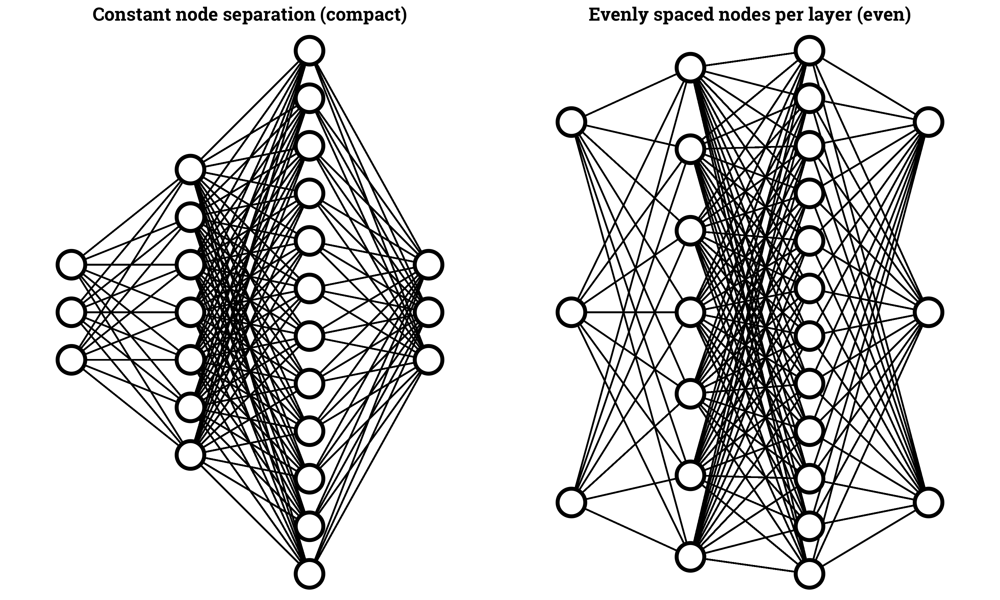

# ggMLP

Need a diagram of a Neural Network and don't feel like drawing 250 lines in PowerPoint/Inkscape? Use `ggMLP()`!

Depends on `ggplot2` and `dplyr`.




## Usage

Simply give as input a vector with the number of nodes per layer.

```R
source("path/to/ggMLP/ggMLP.R")

# A fully connected neural network with 4 layers, each with
# 3, 7, 12 and 3 nodes respectively
nn = c(3, 7, 12, 3)

ggMLP(nn, linewd=.5, node_sep = 'compact')
```


